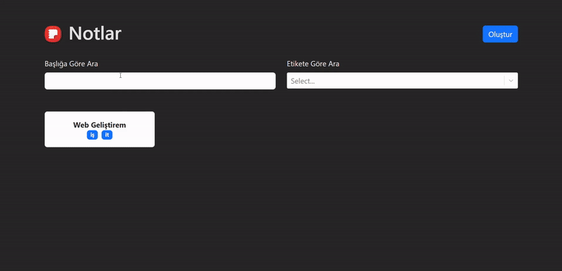

# 📝 NotesApp

## Project Description

Welcome to NotesApp, your ultimate note-taking companion! This app helps you effortlessly create, organize, and find your notes with advanced features like markdown support, tagging, and local storage persistence. Simplify your workflow and keep your thoughts organized with NotesApp!

## Features

- Create and Edit Notes: Effortlessly add and modify notes.
- Tagging System: Organize notes with custom tags for easy access.
- Markdown Support: Format notes for a rich-text experience.
- Search Functionality: Quickly find notes by title or tags.
- Local Storage Persistence: Your notes are securely saved in your browser.

## Used Technologies

- React Router: For page navigation.
- React.js: Interface and UI components.
- Bootstrap: For responsive and modern design.
- React Select: for enhanced dropdown and selection inputs
- React Markdown: Used to render Markdown formatted text in a rich, styled format.
- UUID: Unique identifier generation.
- TypeScript: Adds type safety to JavaScript, ensuring better development experience and fewer runtime errors.

## Development

To develop the project, you can use the following commands:

1. Clone the project.

   ```bash
   git clone https://github.com/emreertugrl/TS_Notes_App.git
   ```

2. Navigate to the project directory:

   ```bash
   cd TS_Notes_App
   ```

3. Install the dependencies:

   ```bash
   npm install
   ```

4. Start the development server:

   ```bash
    npm run dev
   ```

## Visual



## Live Demo

<a href="https://ts-notes-app-emreertugrls-projects.vercel.app/">Vercel Project View</a>

## Contact

For any questions or suggestions, feel free to reach out:

- Email: emreertugrl7@gmail.com
- LinkedIn: [emreertugrul7](https://www.linkedin.com/in/emreertugrul7/)
# TS-NOTES
